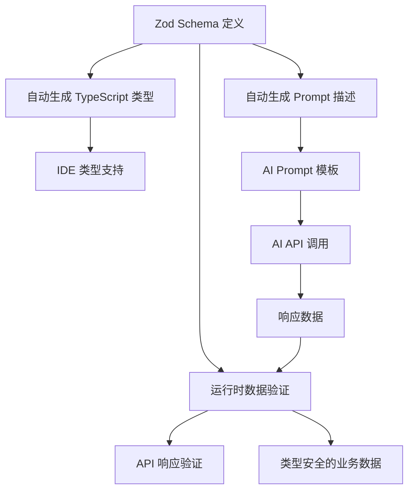

# Schema-First AI响应管理架构

## 🎯 概述

基于业界最佳实践，我们实现了一个完整的 **Schema-First** 架构来管理 AI API 响应，解决了传统方式中需要在多个地方维护相同结构定义的问题。

### 问题背景

在之前的实现中，我们需要在两个地方维护相同的数据结构：
1. **TypeScript 类型定义** - 用于类型检查和IDE支持
2. **AI Prompt 描述** - 告诉AI应该返回什么格式

这导致了：
- 🔄 重复维护成本高
- 🚨 结构不一致风险
- 🛠️ 修改时容易遗漏某一侧

### 解决方案

参考 [Atlassian AI Prompt 最佳实践](https://www.atlassian.com/blog/artificial-intelligence/ultimate-guide-writing-ai-prompts) 和 [Codecademy 的 Prompting 指南](https://www.codecademy.com/article/ai-prompting-best-practices)，我们采用了 **Schema-First** 架构。

## 🏗️ 架构设计

### 1. 核心组件

```
lib/schemas/aiResponseSchemas.ts     ← 📋 单一数据源（Zod Schema）
lib/utils/schemaToPrompt.ts         ← 🔄 Schema到Prompt转换工具
lib/prompts/templates.ts            ← 🎯 Prompt模板（使用Schema生成）
lib/services/aiAnalysisService.ts   ← 🔍 业务逻辑（使用Schema验证）
```

### 2. 数据流程



## 📋 Schema 定义

### 基础示例

```typescript
// 物体识别 Schema
export const ObjectDetectionSchema = z.object({
  name: z.string().describe("物体名称"),
  confidence: z.number().min(0).max(1).describe("识别置信度（0-1）"),
  position: z.object({
    x: z.number().describe("X坐标"),
    y: z.number().describe("Y坐标"), 
    width: z.number().describe("宽度"),
    height: z.number().describe("高度")
  }).optional().describe("物体位置（可选）")
});

// 自动生成的 TypeScript 类型
export type ObjectDetection = z.infer<typeof ObjectDetectionSchema>;
```

### 复杂嵌套结构

```typescript
// 布局建议响应 Schema
export const LayoutSuggestionResponseSchema = z.object({
  layout_type: z.literal('mask_collage').describe("布局类型（固定为mask_collage）"),
  mask_strategy: z.string().describe("遮罩布局策略描述"),
  aspect_ratio: z.string().regex(/^\d+:\d+$/).describe("画布宽高比（如1:1、4:3）"),
  canvas_background: CanvasBackgroundSchema.describe("画布背景配置"),
  suggestions: z.array(LayoutSuggestionItemSchema)
    .min(1)
    .max(20)
    .describe("布局建议数组（1-20个）"),
  // ... 更多字段
});
```

## 🔄 自动转换工具

### Schema 到 Prompt 转换

```typescript
import { generateOutputFormatPrompt } from '@/lib/utils/schemaToPrompt';

// 自动生成 Prompt 输出格式描述
const outputFormatPrompt = generateOutputFormatPrompt(
  ImageAnalysisResponseSchema,
  { 
    title: '输出格式要求', 
    includeExamples: true, 
    includeValidation: true 
  }
);

// 生成的 Prompt 包含：
// - JSON 示例
// - 字段说明
// - 验证规则
// - 注意事项
```

### 生成的 Prompt 示例

```markdown
## 输出格式要求

**严格按照以下JSON格式输出：**

```json
{
  "description": "示例文本",
  "objects": [
    {
      "name": "示例文本",
      "confidence": 0.8,
      "position": {
        "x": 0,
        "y": 0,
        "width": 0,
        "height": 0
      }
    }
  ],
  // ... 更多字段
}
```

**字段说明：**
- `description` **(必需)**：string (最小长度50, 最大长度200)
- `objects` **(必需)**：array (最多10个)
  - `name` **(必需)**：string
  - `confidence` **(必需)**：number (最小值0, 最大值1)
  // ... 更多说明

**验证要求：**
- 必需字段：description, objects, colors, style, themes, keywords, confidence_score
- description最小长度：50
- description最大长度：200
- objects最多元素：10
// ... 更多规则
```

## ✅ 运行时验证

### 安全验证

```typescript
import { safeValidateImageAnalysis } from '@/lib/schemas/aiResponseSchemas';

// 在AI响应解析中使用
const validation = safeValidateImageAnalysis(parsed);
if (validation.success) {
  return validation.data; // 类型安全的数据
} else {
  console.warn('Schema验证失败:', validation.error.issues);
  // 降级处理逻辑
}
```

### 严格验证

```typescript
import { validateImageAnalysis } from '@/lib/schemas/aiResponseSchemas';

try {
  const validatedData = validateImageAnalysis(rawData);
  // 类型安全的数据，验证失败会抛出异常
} catch (error) {
  // 处理验证错误
}
```

## 🚀 使用指南

### 1. 添加新的响应类型

```typescript
// 1. 在 aiResponseSchemas.ts 中定义 Schema
export const NewResponseSchema = z.object({
  field1: z.string().describe("字段1描述"),
  field2: z.number().min(0).describe("字段2描述"),
  // ... 更多字段
});

// 2. 自动生成类型
export type NewResponse = z.infer<typeof NewResponseSchema>;

// 3. 添加验证函数
export function validateNewResponse(data: unknown): NewResponse {
  return NewResponseSchema.parse(data);
}

export function safeValidateNewResponse(data: unknown) {
  return NewResponseSchema.safeParse(data);
}
```

### 2. 在 Prompt 中使用

```typescript
// 在模板中自动生成输出格式
export function generateNewPrompt(): string {
  const outputFormatPrompt = generateOutputFormatPrompt(
    NewResponseSchema,
    { title: '输出格式', includeExamples: true }
  );
  
  return `系统角色...
  
任务描述...

${outputFormatPrompt}

最终指令...`;
}
```

### 3. 在业务逻辑中验证

```typescript
// 在服务中验证响应
const parseNewResponse = (text: string): NewResponse | null => {
  try {
    const parsed = JSON.parse(text);
    const validation = safeValidateNewResponse(parsed);
    
    if (validation.success) {
      return validation.data;
    } else {
      console.warn('验证失败:', validation.error.issues);
      // 降级处理
      return null;
    }
  } catch (error) {
    return null;
  }
};
```

## 📊 优势对比

| 特性 | 传统方式 | Schema-First 方式 |
|------|---------|------------------|
| **数据源** | 🔄 多处维护 | ✅ 单一数据源 |
| **一致性** | 🚨 手动保证 | ✅ 自动保证 |
| **类型安全** | ⚠️ 部分支持 | ✅ 完全支持 |
| **运行时验证** | ❌ 无 | ✅ 全覆盖 |
| **维护成本** | 🔄 高 | ✅ 低 |
| **错误检测** | 🚨 运行时发现 | ✅ 编译时发现 |
| **文档生成** | 📝 手动编写 | ✅ 自动生成 |

## 🛠️ 最佳实践

### 1. Schema 设计原则

- **描述性命名**：字段名要清晰表达含义
- **详细描述**：使用 `.describe()` 提供字段说明
- **合理约束**：设置恰当的验证规则（长度、范围等）
- **可选字段**：合理使用 `.optional()` 标记非必需字段

### 2. 版本管理

```typescript
export const SCHEMA_VERSION = {
  version: '1.0.0',
  lastUpdated: '2025-01-15',
  description: 'AI响应结构的统一Schema定义',
  changelog: [
    '1.0.0 - 初始版本，基于Zod的Schema-First架构',
  ],
} as const;
```

### 3. 错误处理策略

1. **首选**：Schema 验证通过，直接使用
2. **降级**：验证失败但数据基本可用，使用默认值补齐
3. **兜底**：完全失败，使用预设的默认数据

### 4. 性能考虑

- 使用 `safeParse()` 避免异常开销
- 缓存验证结果，避免重复验证
- 在开发环境启用详细日志，生产环境简化

## 🔮 未来扩展

### 1. 自动生成测试用例

```typescript
// 基于 Schema 自动生成测试数据
function generateTestData(schema: ZodSchema): any {
  // 实现基于 Schema 的测试数据生成
}
```

### 2. API 文档自动生成

```typescript
// 基于 Schema 生成 OpenAPI 文档
function generateApiDoc(schemas: Record<string, ZodSchema>): OpenAPISpec {
  // 实现 Schema 到 OpenAPI 的转换
}
```

### 3. 监控和分析

```typescript
// 基于验证结果的质量监控
function trackValidationMetrics(results: ValidationResult[]): void {
  // 统计验证成功率、常见错误等
}
```

## 📚 参考资料

- [Atlassian AI Prompt 最佳实践](https://www.atlassian.com/blog/artificial-intelligence/ultimate-guide-writing-ai-prompts)
- [Codecademy Prompting 指南](https://www.codecademy.com/article/ai-prompting-best-practices)
- [Zod 官方文档](https://zod.dev/)
- [JSON Schema 规范](https://json-schema.org/)

---

*最后更新：2025-01-15*  
*架构版本：v1.0.0* 